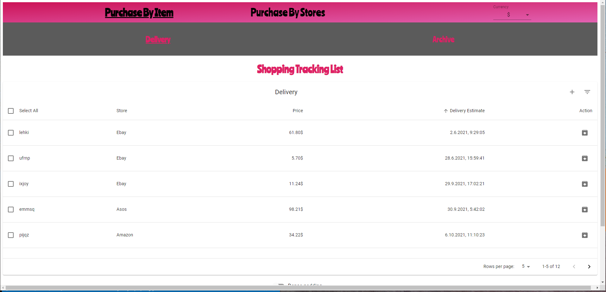
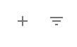
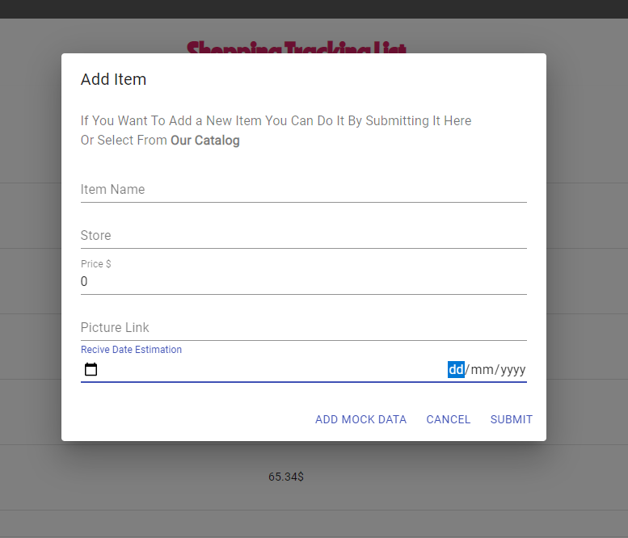
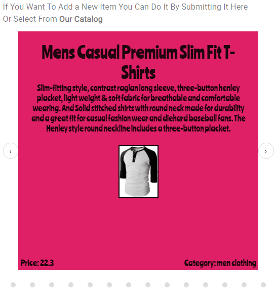
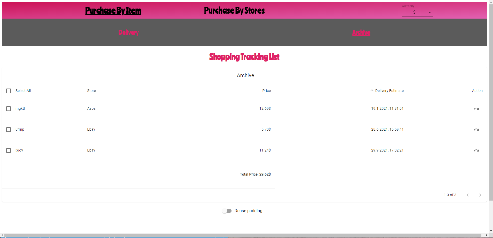
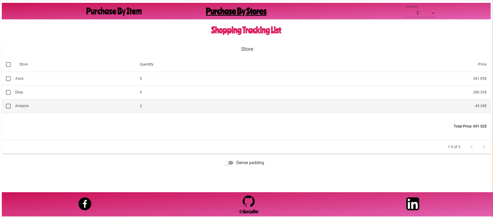
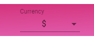
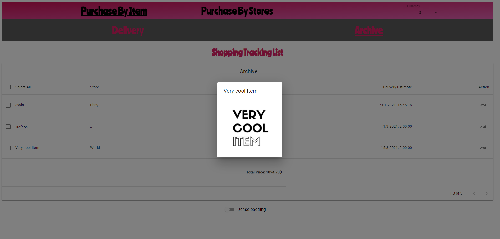

# Shopping Track List
## Enjoy The Shopping Track List Service!
This is a repository of a Shopping Track List service.  
The service offers a tracking app of online items the client has been bought.  
This app is React App styled by pure CSS and use "material-ui" for table structure.  
The app also use a state management - "redux", and routers - "react-router-dom". 
The app also is react hooks as well.  

## App
https://shopping-tracking-list-herolo.web.app

## Main Goals
The main goals of the assignment is control and perform skills of front-end development, by front-end development platform - in this case - React.  
specifically, skills of router and state management control, and deep understanding and communication of this application or another.  

## Project Structure
The structure of the project implemented by 2 main routes, and 6 main states.    
One of the routes divided to another 2 routes.  
Every route use a sub component of table structure.  
The table component itself contains 6 sub components.   
There are three fixed components of navbar, header and footer.    

## General
the repository is a Front - End App with 2 main pages. 

## Instructions To Contribute Users
1. Clone this repo to your device.
2. Open the folder in your editor.
3. Run the command "npm install" or shorter "npm i" in the main folder.
4. Run "npm start" for development environment.
5. Feel free to contribute your own code for this repo and we'll make this app awesome.

## Home Page / Items Page
    The home/items page contains a list of of all your tracing items you've been uploaded to the system.
    This page is separated to 2 sub pages:
### Delivery Page
    The Delivery Page contains a list of all your tracking items which you didn't got yet.
    The default order of the items is by their ascended estimate delivery date, buy on click on every other category the order will change.  
    Moreover, by one more click on the category the order will be the opposite.
  
    In this exclusive page, you have two options: 
#### Icons Buttons 
    The Filter Button will automatically order your items by archive items that have been already arrived by their estimated delivery date, and delivery items which have not arrived yet. By clicking it again, it will return to your first order. Furthermore, you can control the order of your items manually. 
  
#### Add Item 
    This is an add item modal.
    In this modal you can add your item to system and track it.  
    There is a option of add a mock data, to see the system working ...   
    Moreover, there is a Catalog of a API products you can choose to add - by clicking the link.
      
#### Catalog    
    The Catalog came from an API, so you can not control it.  
    The Catalog offers some products rolling by carousel ("styled-components-carousel").    
    By clicking an product of the catalog, the details of the specific product will automatically update in the form, and all you need to complete is the store and the estimate delivery date.  
      
### Archive Page
    The Archive Page contains a list of all your tracking items which you did got.    
    The same - The default order of the items is by their ascended estimate delivery date, buy on click on every other category the order will change.   
    Moreover, by one more click on the category the order will be the opposite.  
  

## Store Page
    The Store Page contains a list of all your tracking items order by store.  
    You can order the list By clicking on every head cell, and double click it will order it opposite as well.
  

## Currency
    All the pages contain the total price of the items.  
    In the navbar you can choose your currency coin - Dollar($) or Shekel(₪).  
    This feature uses a state management ("recoil").  
    By clicking on it all of the system will automatically change the currency coin - updating every 10 seconds by public API that fetch this data.
  

## Pop Up Picture
    On mouse over for 1.5 seconds, if you add a picture to the item, it will automatically appear in a Pop Up window.  
    You can cancel it by clicking on the background window.
  

